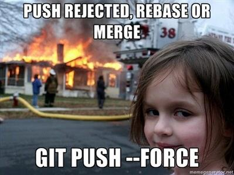

# Git
## Read this first
[15 советов по работе с Github](https://habr.com/company/mailru/blog/359246/)


## Useful git alias
```
alias.co checkout
alias.ci commit
alias.st status
alias.br branch
alias.hist log --pretty=format:'%h %ad | %s%d [%an]' --graph --date=short
alias.type cat-file -t
alias.dump cat-file -p
```

## clone branch
`git clone -b my-branch https://git@github.com/username/myproject.git`
`git clone -b opencv-2.4 --single-branch https://github.com/Itseez/opencv.git`

## work with some folders
```
git init <repo>
cd <repo>
git remote add -f origin <url>
git config core.sparseCheckout true
echo "some/dir/" >> .git/info/sparse-checkout
echo "another/sub/tree" >> .git/info/sparse-checkout
# Update your working directory with 
git read-tree -mu HEAD


```
[source](https://stackoverflow.com/questions/600079/is-there-any-way-to-clone-a-git-repositorys-sub-directory-only)
[source](http://jasonkarns.com/blog/subdirectory-checkouts-with-git-sparse-checkout/)
[source](https://stackoverflow.com/questions/35806042/git-sparse-checkout-not-working-as-expected)


## How to make a new release

* Update/verify the version in the `VERSION` file
* Update/verify that the changelog has been updated
* Commit everything
* Run `git tag -s <version>` to tag the version in Git
* Run `make release`
* Finally, set the upcoming version in the `VERSION` file, usually be
  incrementing the patch level, and possibly by appending `-dev`. Probably you
  want to `git push` once more.

## Some recommendations  
* Try to avoid `git commit -am "asdf"`, and commit consciously. Unless, of course, there’s an emergency.




## Readthis
http://git-scm.com/book/ru/v1/Инструменты-Git-Подмодули

## Clone a branch without fetching other branches
```
mkdir $BRANCH
cd $BRANCH
git init
git remote add -t $BRANCH -f origin $REMOTE_REPO
git checkout $BRANCH
```
or
```
git clone --single-branch -b branch host:/dir.git
```